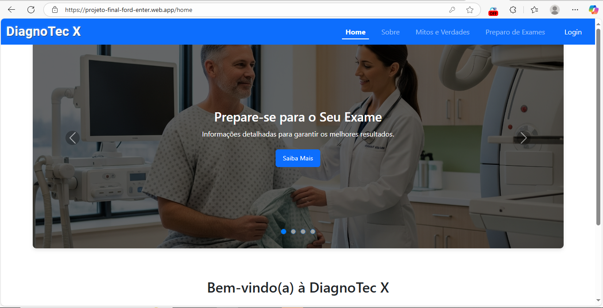
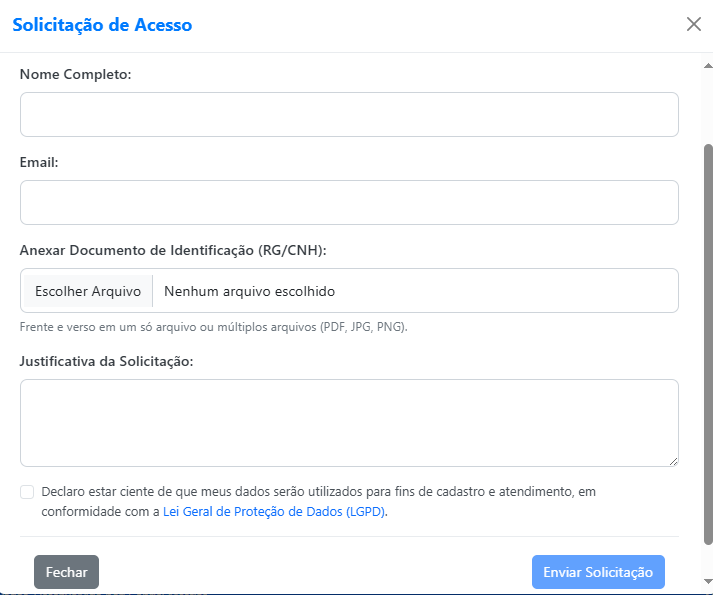
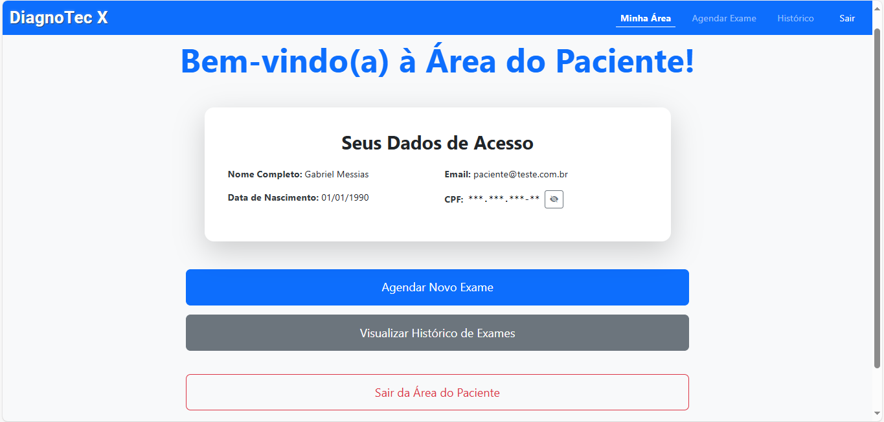
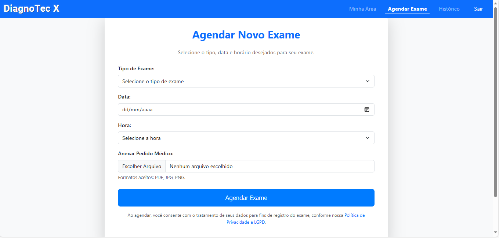
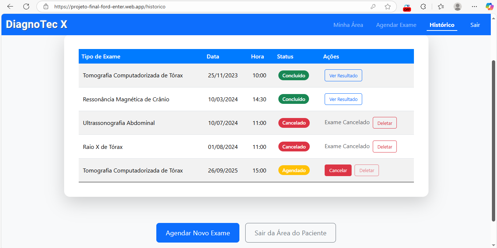
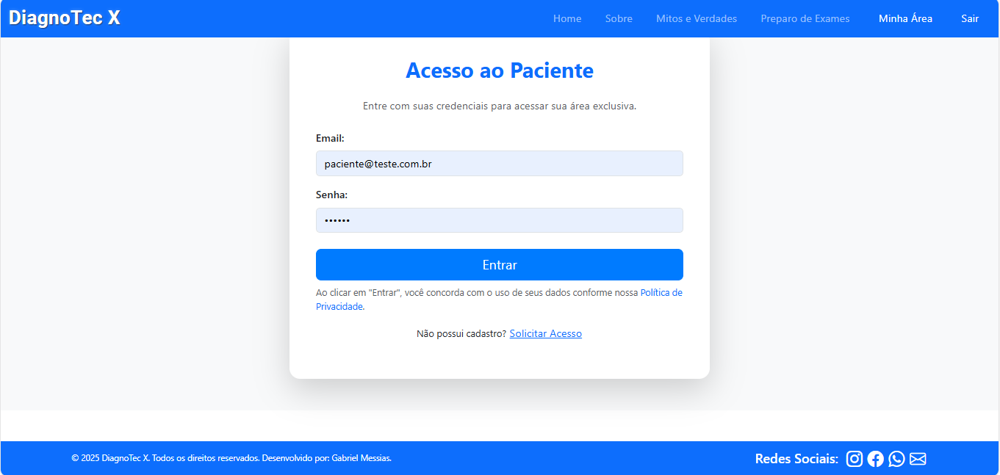

# Sistema de Agendamento de Exames - Projeto Final Ford Enter

Este é o projeto final do curso **Ford Enter**, desenvolvido como um sistema de agendamento de exames médicos utilizando **Angular** e **Firebase**.  
O sistema foi projetado com foco em **Front-End**, mas algumas integrações básicas com banco de dados e autenticação foram implementadas.

---

## 🚀 Deploy do Projeto
O sistema está hospedado no **Firebase Hosting** e pode ser acessado através do link:  
👉 [Acessar Sistema](https://projeto-final-ford-enter.web.app/)

---

## 📂 Estrutura de Pastas
Abaixo está a organização principal do projeto (Angular):

```
src/app
 ├── core
 │    ├── auth.service.ts
 │    ├── exam.service.ts
 │    └── login.guard.ts
 │
 ├── pages
 │    ├── area-do-paciente
 │    ├── historico
 │    ├── home
 │    ├── info
 │    ├── login
 │    ├── marcacao
 │    ├── mitos
 │    └── preparo
 │
 ├── shared
 │    ├── carousel
 │    ├── footer
 │    ├── navbar
 │    ├── politica-modal
 │    └── registration-request-modal
 │
 ├── app.component.css
 ├── app.component.html
 ├── app.component.ts
 └── app.config.ts
 └── ...
```

---

## 🛠️ Tecnologias Utilizadas
- **Angular** (framework principal)
- **Firebase** (hospedagem, autenticação e banco de dados)
- **Bootstrap** (estilização e responsividade)
- **HTML5 / CSS3 / TypeScript**

---

## 🔐 Login de Teste
Para acessar a área de paciente, utilize as seguintes credenciais já cadastradas no **Firebase Authentication**:

- **E-mail:** `paciente@teste.com.br`  
- **Senha:** `123456`  

---

## 📋 Funcionalidades

### Público (sem login)
- Página inicial com **carrossel de imagens**.
- Páginas de informações: Home, Info, Preparo e Mitos.
- Footer com **copyright** e links para redes sociais.
- **Formulário de solicitação de cadastro** (não funcional, apenas visual).

### Login e Autenticação
- Autenticação integrada ao **Firebase**.
- Redirecionamento para a área protegida após login.

### Área do Paciente (com login)
- Visualização de dados do paciente.
- **Agendamento de exames**:
  - Escolha de data e hora.
  - Seleção do tipo de exame.
  - Upload do pedido médico.
  - Registro do exame no **Firebase Database** (CRUD).

- **Histórico de exames**:
  - Exames confirmados, agendados, cancelados e concluídos.
  - Possibilidade de baixar resultado (apenas visual, não funcional).

### Menus Dinâmicos
Utilizando **NgIf**, o projeto possui três variações de **Navbar**:
1. Visitante (não logado, na página inicial).
2. Usuário logado (área protegida de marcação e histórico).
3. Usuário logado acessando páginas públicas (com opção de voltar à área do paciente).

---

## 📸 Imagens do Sistema

### Página Inicial


### Formulário de Solicitação de Cadastro


### Área do Paciente


### Agendamento de Exames


### Histórico de Exames


### Tela de Login


---

## 📌 Observações
- Algumas partes do sistema são **apenas visuais**, sem integração completa com o Firebase (ex: envio de solicitação de cadastro, download de PDF de resultado).  
- O foco do projeto foi o **Front-End em Angular**, conforme exigência do curso.  
- O sistema foi desenvolvido como **projeto TCC** do programa Ford Enter.

---

## 👨‍💻 Autor
Projeto desenvolvido por **Gabriel Messias**  
👉 [LinkedIn](https://www.linkedin.com/in/gabrielmessias-dev)  
👉 [GitHub](https://github.com/gabrielmessias-dev)
